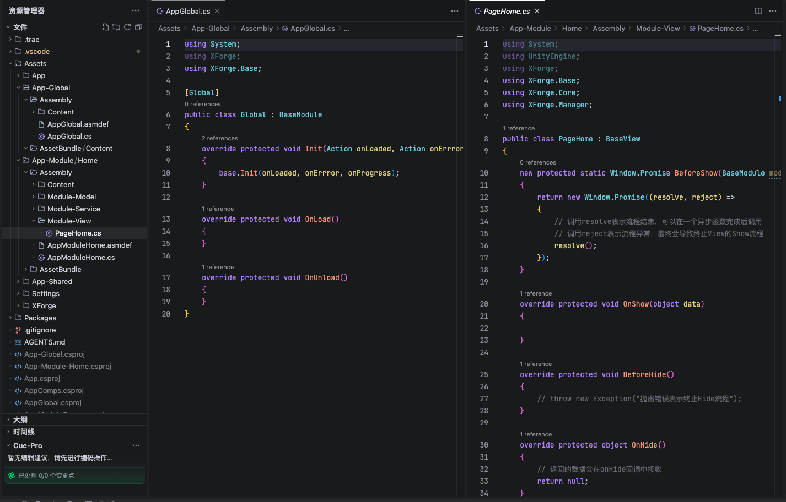
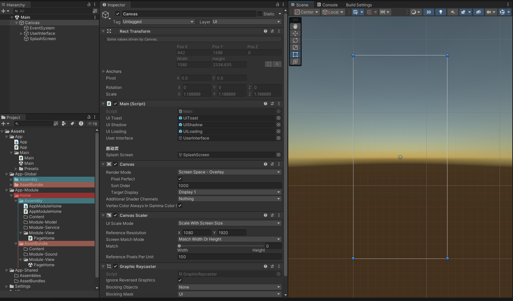
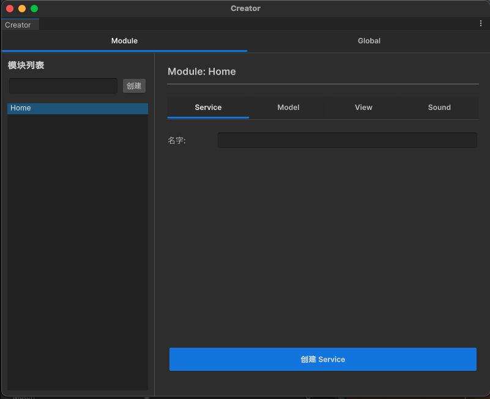
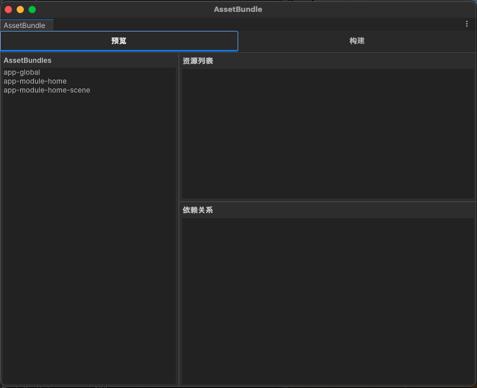

# 目前在内测阶段，星星超过300后可提前开源

## 简介
XForge2在框架层面上完全抹除了两个引擎之间的差异。如果你是一个Unity初学者，你甚至不需要了解Unity中关于程序集和AssetBundle的相关知识，完全使用XForge2提供的工具和API即可完成与CocosCreator中一样的开发体验。
> Unity中的AssetBundle与CocosCreator中的AssetBundle有很多的差异，具体可以通过询问AI来了解。

### 一、Unity版本的代码与Cocos版本保持一致

### 二、Unity版本的目录结构与Cocos版本保持一致

### 三、Unity版本的菜单工具与Cocos版本功能保持一致

### 四、Unity版本单独提供的AssetBundle构建工具
> 原因是Unity与CocosCreator在设计理念上的不同，Unity需要自己写AB构建工具，而CocosCreator是集成在构建流程中的。

